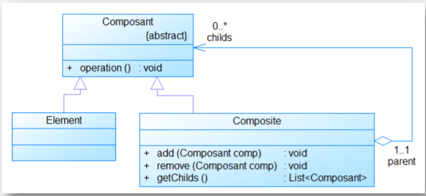
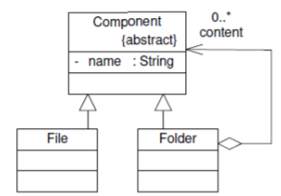
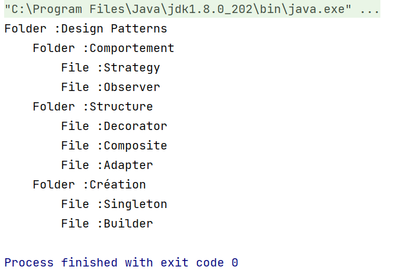

# Pattern Composite
### Catégorie :
    • Structure
### Objectif du pattern Composite
    • Organiser les objets en structure arborescente afin dereprésenter une hiérarchie.
    • Permettre à la partie cliente de manipuler un objet unique et un objet composé de la même manière.
### Résultat :
    • Le Design Pattern permet d'isoler l'appartenance à un agrégat.

 
### Raison d’utilisation
    • Le système comporte une hiérarchie avec un nombre de niveaux non déterminé.
    • Il est nécessaire de pouvoir considérer un groupe d'éléments comme un
    élément unique.
    • Cela peut être le cas des éléments graphiques d'un logiciel de DAO.
    Plusieurs éléments graphiques peuvent être regroupés en un nouvel élément
    graphique.
    • Chaque élément est un composant potentiel. En plus des éléments
    classiques, il y a un élément composite qui peut être composés de plusieurs
    composants.
    • Comme l'élément composite est un composant potentiel, il peut être
    composé d'autres éléments composites.
### Responsabilités
-Composant :
    • Définit l'interface d'un objet pouvant être un composant d'un autre objet de
    l'arborescence.
-Element :
    • implémente un objet de l'arborescence n'ayant pas d'objet le composant.
-Composite :
    • implémente un objet de l'arborescence ayant un ou des objets le composant.
    • La partie client manipule les objets par l'interface Composant.
 ## Implimentation 
 ### Un dossier peut contenir des fichiers ou des dossiers
 

 ### class Component
 ```java
    package comp;

public abstract class Component {
    protected String name;
    protected int level=0;
    public abstract void show();

    public Component(String name) {
        this.name = name;
    }
    public String tab(){
        String tab="";
        for(int i=0;i<level;i++){
            tab+="\t";
        }
        return tab;
    }
}

```
### class File
 ```java
 package comp;

public class File extends Component{

    public File(String name) {
        super(name);
    }

    @Override
    public void show() {
        System.out.println(tab()+"File :"+name);
    }
}
```
### class Folder
 ```java
 package comp;

import java.util.ArrayList;
import java.util.List;

public class Folder extends Component{
    private List<Component> childs=new ArrayList<>();
    public Folder(String name) {
        super(name);
    }
    public Component addComponent(Component component){
        component.level=this.level+1;
        childs.add(component);
        return component;
    }
    @Override
    public void show() {
        System.out.println(tab()+"Folder :"+name);
        for(Component c:childs){
            c.show();
        }
    }
}
```
## Test
### class Application
 ```java
import comp.File;
import comp.Folder;

public class Application {
    public static void main(String[] args) {
        Folder root=new Folder("Design Patterns");
        Folder d1=(Folder) root.addComponent(new Folder("Comportement"));
        Folder d2=(Folder) root.addComponent(new Folder("Structure"));
        Folder d3=(Folder) root.addComponent(new Folder("Création"));
        d1.addComponent(new File("Strategy"));
        d1.addComponent(new File("Observer"));
        d2.addComponent(new File("Decorator"));
        d2.addComponent(new File("Composite"));
        d2.addComponent(new File("Adapter"));
        d3.addComponent(new File("Singleton"));
        d3.addComponent(new File("Builder"));
        root.show();
    }
}
```
### Output
 


