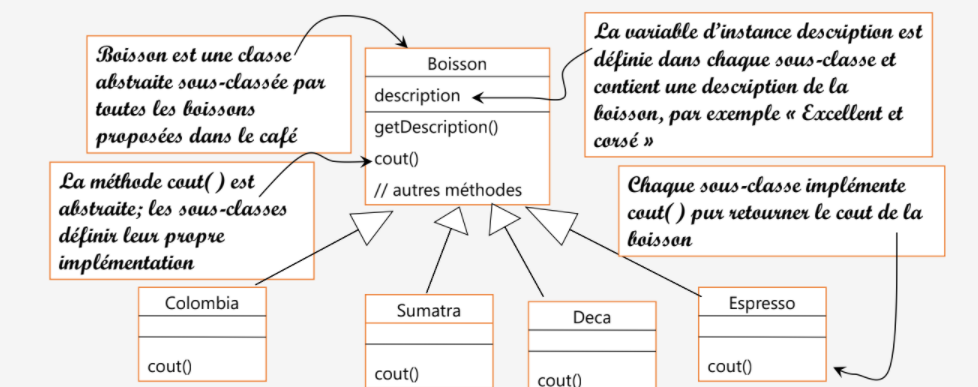
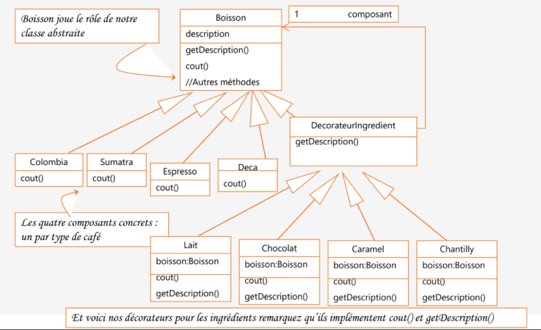
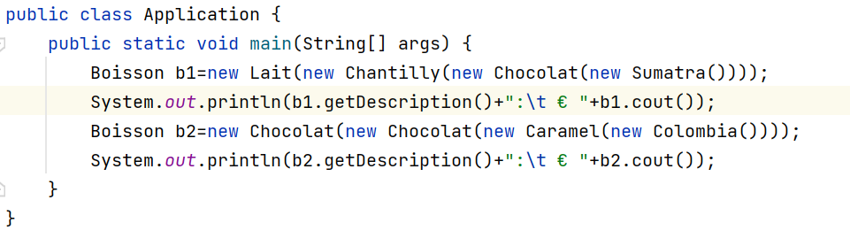
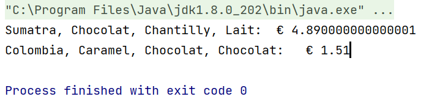

# Probleme: Decorator pattern
    Starbuzz Coffee s’est fait un nom en devenant la plus importante chaîne de « salons de café »
    aux états unis.
    Quand ils ont commencé, ils on conçu leurs classes comme ceci:
 
    En plus de votre café, vous pouvez également demander
    plusieurs ingrédients, comme
    • de la mousse de lait,
    • du caramel,
    • du chocolat,
    • du sirop,
    • de la vanille
    • ou noisette
    • et couronner le tout avec de la crème chantilly.
    Starbuzz Coffee, facturant chacun de ces suppléments, ils ont
    besoin de les intégrer à leur système de commande
# Conception du problème en utilisant le modèle de Design Pattern Decorator
 
# Implimentation
### class Boisson
```java
    package decorator;

    public abstract class Boisson {
        protected String description;

        public String getDescription() {
            return description;
        }
        public abstract double cout();
    }

```
### class Espresso
```java
    package decorator;

    public class Espresso extends Boisson{
        public Espresso() {
            description="Espresso";
        }

        @Override
        public double cout() {
            return 1.99;
        }
    }

```
### class Sumatra
```java
    package decorator;

    public class Sumatra extends Boisson{

        @Override
        public double cout() {
            return 3.99;
        }
        public Sumatra() {
            description="Sumatra";
        }
    }
```
### class Colombia
```java
    package decorator;

    public class Colombia extends Boisson{
        public Colombia(){
            description="Colombia";
        }
        @Override
        public double cout() {
            return 0.89;
        }
    }
```
### class Deca
```java
    package decorator;

    public class Deca extends Boisson{
        @Override
        public double cout() {
            return 4.99;
        }
        public Deca() {
            description="Deca";
        }
    }
```
### class DecorateurIngredient
```java
    package decorator;

    public abstract class DecorateurIngredient extends Boisson{
        protected Boisson boisson;
        public abstract String getDescription();
        public DecorateurIngredient(Boisson boisson){
            this.boisson=boisson;
        }
    }
```
### class Caramel
```java
    package decorator;

    public class Caramel extends DecorateurIngredient{
        public Caramel(Boisson boisson) {
            super(boisson);
        }

        @Override
        public double cout() {
            return 0.22+boisson.cout();
        }

        @Override
        public String getDescription() {
            return boisson.getDescription()+", Caramel";
        }
    }
```
### class Lait
```java
    package decorator;

    public class Lait extends DecorateurIngredient{
        public Lait(Boisson boisson) {
            super(boisson);
        }

        @Override
        public double cout() {
            return 0.30+boisson.cout();
        }

        @Override
        public String getDescription() {
            return boisson.getDescription()+", Lait";
        }
    }
```
### class Chocolat
```java
    package decorator;

    public class Chocolat extends DecorateurIngredient{
        public Chocolat(Boisson boisson) {
            super(boisson);
        }

        @Override
        public double cout() {
            return 0.20+boisson.cout();
        }

        @Override
        public String getDescription() {
            return boisson.getDescription()+", Chocolat";
        }
    }
```
### class Chantilly
```java
    package decorator;

    public class Chantilly extends DecorateurIngredient{
        public Chantilly(Boisson boisson) {
            super(boisson);
        }

        @Override
        public double cout() {
            return 0.40+boisson.cout();
        }

        @Override
        public String getDescription() {
            return boisson.getDescription()+", Chantilly";
        }
    }
```
# Test
### class Application

### outPut

