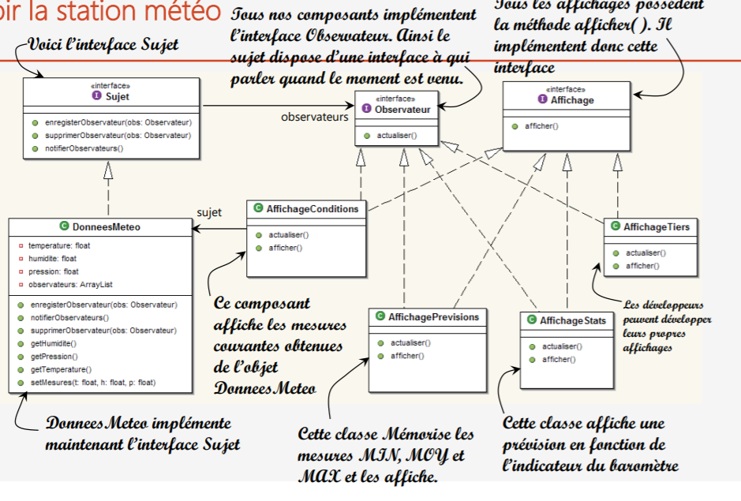

# Implimentation Design Pattern Observer
## Cahier des charges
Félicitation! Votre société a été retenue pour construire notre station météorologique de dernière génération
consultable en ligne!
La station sera basée sur notre objet DonneesMeteo (brevet en cours),qui enregistre les conditions météorologique
à un moment donné (température, hygrométrie et pression atmosphérique).
Nous aimerions que vous nous créiez une application qui fournira d’abord trois affichages: conditions actuelles,
statistiques et prévisions simples, tous trois mis à jour en temps réel au fur et à mesure que l’objet DonneesMeteo acquiert les
données les plus récentes.
De plus cette station météo doit être extensible. MétéoExpress veut commercialiser une API pour que les autres
développeurs puissent réaliser leurs propres affichages et les insérer directement. Nous souhaitons que vous nous fournissiez
cette API !
MétéoExpress est convaincu d’avoir un excellent modèle métier: une fois les clients acrochés, nous prévoyons de
les facturer pour chaque affichage qu’ils utilisent.
Le meilleur est pour la fin : vous serez payé en stock options.
Nous attendons avec impatience vos documents de conception et votre première version alpha
Cordialement,
Jean-Loup Ragan, PDG MétéoExpress
P.S. Nous vous envoyons par chrono les fichiers source de DonnesMeteo
### ---------------------------------------------------------------------------------------------------------------------------------------
La classe DonneesMeteo a des méthodes d’accès pour trois valeurs de mesures: température, hygrométrie, pression atmosphérique.
La méthode actualiserMesures() est appelée chaque fois qu’une nouvelle mesure est disponible. Nous ne savons pas comment cette
méthode est appelée, et peu importe.
Nous devrons implémenter trois affichages qui utilisent les données météorologiques:
    • Un affichage des conditions actuelles
    • Un affichage des statistiques
    • Un affichage des prévisions.
Ces trois affichages doivent être mis à jour, chaque fois que DonnesMeteo aquiert de nouvelles données.
Le système doit être extensible:
    • D’autres développeurs pourrons créer d’autres affichages personnalisés
    • Les utilisateurs pourront ajouter ou retirer autant d ’éléments qu’ils le souhaitaient à l’application
    • Actuellement, nous ne connaissons que les trois types d’affichages initiaux
    • Conditions actuelles
    • Statistiques
    • prévisions

 
 # Implimentation
 ### interface Affichage
 ```java
   public interface Affichage {

    void afficher();
}
```
 ### interface Affichage
 ```java
   public interface Affichage {

    void afficher();
}
```
 ### interface Observateur
 ```java
public interface Observateur {

    void actualiser(float t, float h, float p);

}
```
 ### interface Sujet
 ```java
public interface Sujet {

    void enregisterObservateur(Observateur obs);

    void supprimerObservateur(Observateur obs);

    void notifierObservateurs();

}
```
 ### class AffichageCondition
 ```java
public class AffichageConditions implements  Observateur,Affichage{
    private float temperature;
    private float humidite;
    private Sujet donneesMeteo;
    public AffichageConditions(Sujet dm){
        this.donneesMeteo=dm;
        donneesMeteo.enregisterObservateur(this);
    }

    @Override
    public void afficher() {
        System.out.println("Conditions actuelles:"+
                temperature+" degès et "+humidite+" % d'hmidité");
    }

    @Override
    public void actualiser(float t, float h, float p) {
        this.temperature=t;
        this.humidite=h;
        afficher();
    }
}
 ```
 ### class DonneeMeteo 
 ```java
import java.util.ArrayList;
import java.util.List;

public class DonneeMeteo implements Sujet {
    private float temperature;
    private float humidite;
    private float pression;
    private List<Observateur> observateurs = new ArrayList();

    @Override
    public void enregisterObservateur(Observateur obs) {
        observateurs.add(obs);
    }

    @Override
    public void supprimerObservateur(Observateur obs) {
        int i = observateurs.indexOf(obs);
        if (i >= 0) {
            observateurs.remove(i);
        }
    }

    @Override
    public void notifierObservateurs() {
        for(int i=0;i<observateurs.size();i++){
            Observateur o=(Observateur)observateurs.get(i);
            o.actualiser(temperature,humidite,pression);
        }
    }
    public void setMesures(float t, float h, float p) {
        this.temperature=t;
        this.humidite=h;
        this.pression=p;
        actualiserMesures();
    }
    public void actualiserMesures() {
        notifierObservateurs();
    }

}
```
## Test
 
## OUTPUT
 
