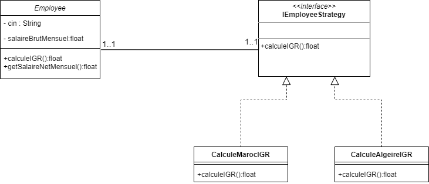

#Exercice d'implémentation
    On considère la classe Employe (voir annexe) qui est définie par :
    • deux variables d’instance cin et salaireBrutMensuel,
    • deux constructeurs, les getters et setters
    • et une méthode calculerIGR qui retourne l’impôt général sur les revenus salariaux.
    • La méthode getSalaireNetMensuel retourne le salaire net mensuel.
    Supposant que la formule de calcul de l’IGR diffère d’un pays à l’autre.
    Au Maroc, par exemple le calcul s’effectue selon les cas suivant :
    • Si le salaire annuel est inférieur à 40000, le taux de l’IGR est : 5%
    • Si le salaire annuel est supérieur à 40000 et inférieur à 120000, le taux de l’IGR est : 20%
    • Si le salaire annuel est supérieur à 120000 le taux de l’IGR est : 42%
    En Algérie, le calcul s’effectue en utilisant un taux unique de 35%.
    Comme cette classe est destinée à être utilisée dans différent type de pays inconnus au moment du développement de
    cette classe,
    1. Identifier les méthodes qui vont subir des changements chez le client.
    2. En appliquant le pattern strategie, essayer de rendre cette classe fermée à la modification et ouverte à l’extension.
    3. Créer une application de test.
    4. Proposer une solution pour choisir dynamiquement l’implémentation de calcul de l’IGR.

```java
    public class Employee {
    private String cin;
    private float salaireBrutMensuel;
    private IEmployeeStrategy employeeStrategy;
    public Employee() {
    }

    public Employee(String cin, float salaireBrutMensuel) {
        this.cin = cin;
        this.salaireBrutMensuel = salaireBrutMensuel;
    }
    public float calculerIGR(){
        float salaireBrutAnuel=salaireBrutMensuel*12;
        float taux=42;
        return employeeStrategy.calculerIGR(salaireBrutMensuel);
    }
    public float getSalaireNetMensuel(){
        float igr=calculerIGR();
        float salaireNetAnuel=salaireBrutMensuel*12-igr;
        return salaireNetAnuel/12;
    }
    // getters & setters
```
 #Conception du problème en utilisant le design pattern stratégie
 
 #Implementation
 ###IEmployeeStrategy
 ```java
    package Strategy;

    public interface IEmployeeStrategy{
    public float calculerIGR(float salaireMensuelBrut);
}
```
###CalculeMarocIGR
 ```java
    package Strategy;

    public class CalculeMarocIGR implements IEmployeeStrategy {
        @Override
        public float calculerIGR(float salaireMensuelBrut) {
            float salaireAnnuelBrut=salaireMensuelBrut*12;
            if(salaireAnnuelBrut <= 40000) return salaireAnnuelBrut*5/100;
            if(salaireAnnuelBrut > 40000 && salaireAnnuelBrut <= 120000) return salaireAnnuelBrut*20/100;
            if(salaireAnnuelBrut < 120000) return salaireAnnuelBrut*42/100;
            return  0;
        }
    }
```
###CalculeAlgerieIGR
 ```java
    package Strategy;

    public class CalculeAlgerieIGR implements IEmployeeStrategy{
        @Override
        public float calculerIGR(float salaireMensuelBrut) {
            float salaireAnnuelBrut = salaireMensuelBrut * 12;
            return salaireAnnuelBrut * 35 /100;
        }
    }

```

###Application
 ```java
package test;

import Strategy.Employee;
import Strategy.IEmployeeStrategy;

import java.util.Scanner;

public class Application {
    public static void main(String[] args) {
        Employee employee = new Employee("VA137430",7000);
        Scanner sc=new Scanner(System.in);
        while(true){
            System.out.print("Nom strategie:");
            String nomStrategie=sc.next();
            if(nomStrategie.equals("quit")) break;
            try {
                Class c = Class.forName(nomStrategie);
                IEmployeeStrategy strategy = (IEmployeeStrategy) c.newInstance();
                employee.setEmployeeStrategy(strategy);
                System.out.println(employee.calculerIGR());
            } catch (Exception e) {
                System.out.println(e);
            } }
    }
}

```